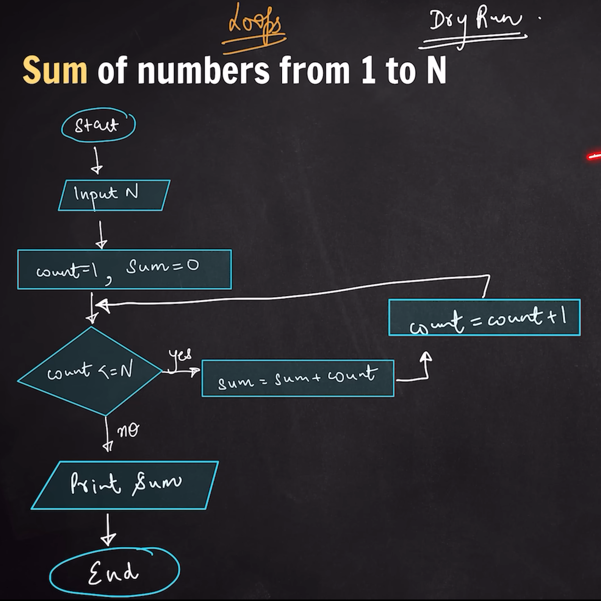

## Introduction to Flowchart & Pseudocode

### Flow Chart

Diagram of a solution

### Pseudocode --> English Like

General Logic of Solution

### Example - Min of 2 numbers

### Example Sum from 1 to N

### Example - Prime No. or Not

