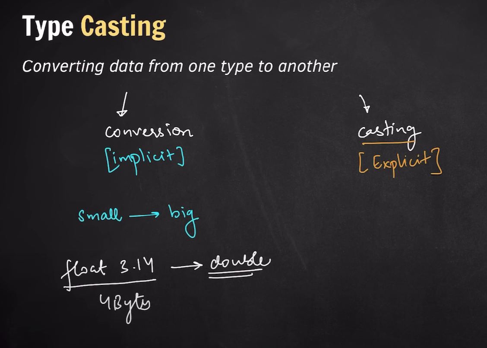

## Type Conversion & Type Casting

#### Type Conversion

- Small -> Big Data Type
- Complier does it automatically
- Implicit

#### Type Casting

- Big -> Small Data Type (Generally)
- Complier does not do it automatically | programmer has to define
- Explicit



## Types of Operators

- Airthematic --> +, -, /, \*, %
- Relational --> >, <, >=, <=, ==, !=
- Logical --> AND &&, OR ||, NOT !
- Bitwise --> In next lecture
- Unary --> a++, ++a, a--, --a [Adding or Substracting by 1]

```c++
#include <iostream>
using namespace std;
int main() {

    // 1. Airthematic Operator

    int a = 11, b = 5;
    cout << "Addition:- " << (a+b) << endl;
    cout << "substraction:- " << (a-b) << endl;
    cout << "Multiplication:- " << (a*b) << endl;
    cout << "Division:- " << (a/b) << endl;

    // Result dataType will be defind by the bigger variable's dataType (Either in numerator or denominator)
    cout << "Division with type casting:- " << (a/ (double)b) << endl;


    //2. Relational Operator <, <=, >, >=, ==, != ---- return either true(1) or false(0)

    cout << (3 > 5) << endl; // false --> 0
    cout << (3 < 5) << endl; // true --> 1
    cout << (3 >= 5) << endl; // false --> 0
    cout << (3 <= 5) << endl; // true --> 1
    cout << (3 == 5) << endl; // false --> 0
    cout << (3 != 5) << endl; // true --> 1

    //3. Logical Operators | AND (&&), OR (||), NOT (!)
    cout << ((3 >= 5) || (3 < 5)) << endl; // true 1

    //4. Bitwise Operator --> In next lecture

    //5. Unary Operator (Adding or Substracting by 1)
    //      a++ --> kaam > update
    //      ++a --> update > kaam

    int x = 7;
    int y = x++; // kaam : update

    cout << "x :- " << x << endl; // ans 8
    cout << "y :- " << y << endl; // ans 7

    x = 7; // resetting it to 7 to see the changes
    int z = ++x; // update : kaam
    cout << "x :- " << x << endl; // ans 8
    cout << "z :- " << z << endl; // ans 8

    return 0;
}

```
