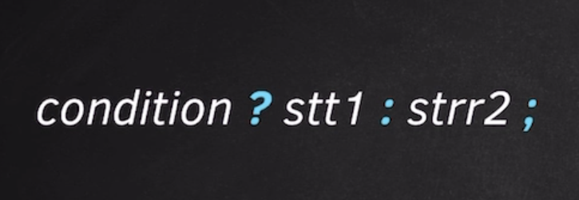

### Ternary Statement



#### Importtant Points

- we can write if else in a single line concisely
- Used for very simple if else statement
- if we have 2 statemnet in if-else we generally don't prefer ternary statement

### Loops

#### 1. While Loop

- ```c++
  // Count from 1 to n
    int n = 10;
    int i = 1;

    while (i <= n) {
        cout << i << " ";
        i++;
    }

    cout << endl;
  ```

#### 2. For Loop

- ```c++
  // Syntax

  for(initialisation; condition; updation) {
      // work
  }
  ```

- ```c++
  // Count from 1 to n

    for(int i = 1; i <= n; i++ ) {
        cout << i << " ";
    }

    cout << endl;
  ```

#### Do While Loop

- Will run atleast once even when the condition in False
- ```c++
  // Syntax

    do {
      // work
    }
    while (condition);
  ```

### Break, Continue Statement

### Prime Or Not Example

- ```c++
  int primeOrNot() {

      int n = 89;

      // for (int i = 2; i < n - 1; i++ ) {

      // Optimization --> We have check it only from 1 to sqrt(n)
      for (int i = 2; i * i < n - 1; i++ ) {
          if (n % i == 0) {
              cout << i << endl;
              cout << "Non Prime" << endl;
              return 0;
          }
      }

      cout << "Prime" << endl;

      return 0;
  };
  ```
