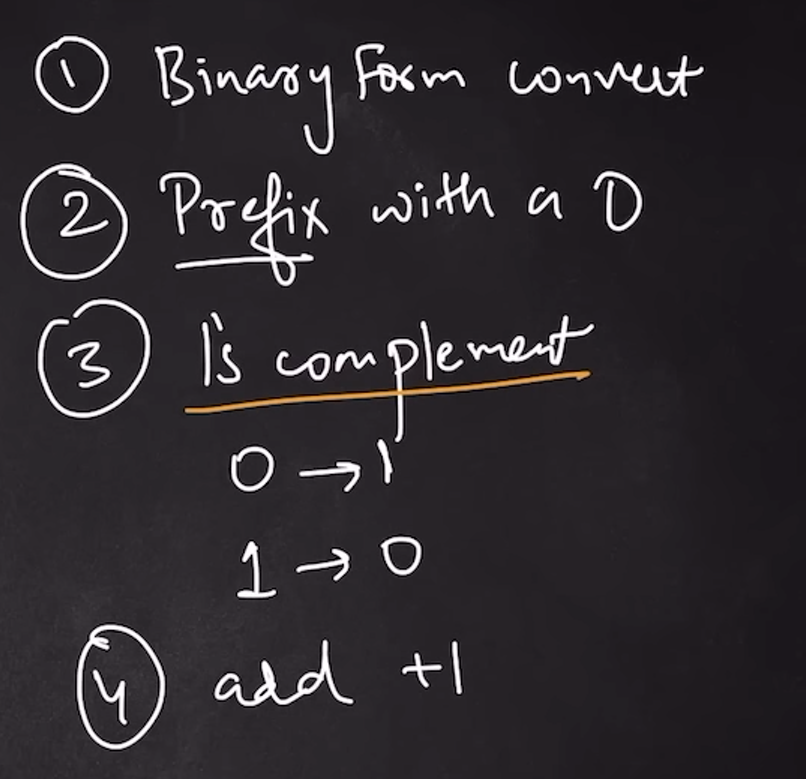

### Two's Complement



# Identifying Positive and Negative Numbers in Two's Complement

In **two's complement** representation, you can identify whether a binary number is positive or negative by looking at the **most significant bit (MSB)**, also known as the **sign bit**.

## Rule:
- **If the MSB is 0**: The number is **positive**.
- **If the MSB is 1**: The number is **negative**.

The **MSB** is the leftmost bit in the binary representation.

## Example 1: `0000 0101` (8-bit binary)

```bash
0000 0101
```
MSB = 0
The number is positive.
In decimal, this is 5.

## Example 2: 1111 1101 (8-bit binary)
```bash
1111 1101
```
MSB = 1
The number is negative.

### To determine its magnitude, follow the steps below to find its two's complement:

#### Steps to Convert a Positive Number to Two's Complement (Negative):
To convert a positive number to its negative representation in two's complement, follow these steps:
1. Write the binary representation of the positive number.
2. Invert all the bits (1’s complement).
3. Add 1 to the inverted number.