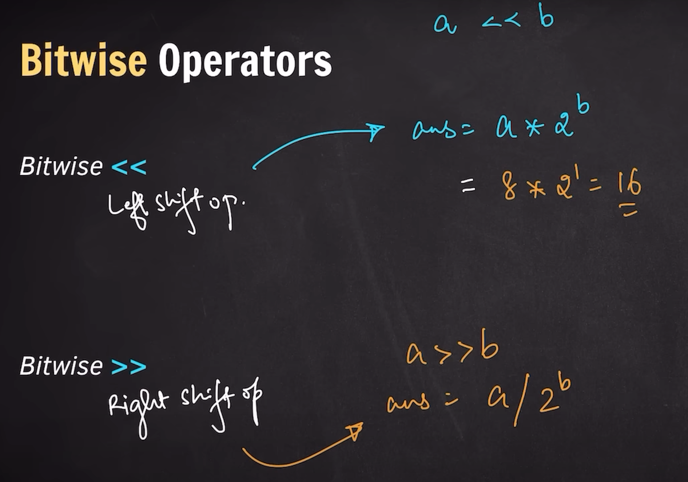
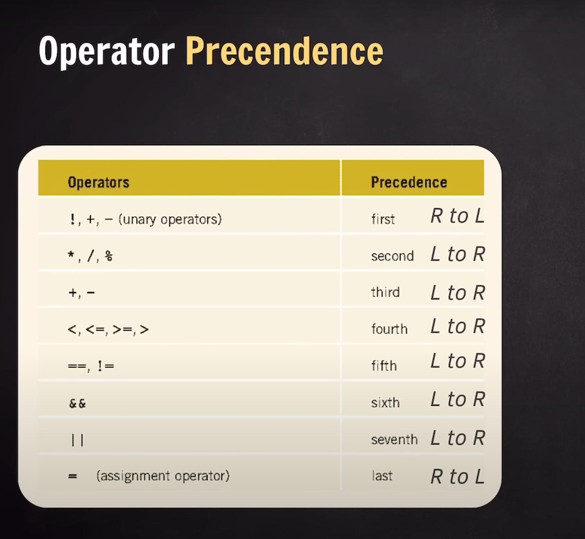

## Bitwise Operator



## Order Precedence



## Data Type Modifiers

### Changes the Meaning of data type

- long
- short
- long long
- signed
- unsigned

```c++
long int -> 8
short int -> 2
long long int -> 8
long long -> 8
unsigned int -> 4
signed int -> 4
```