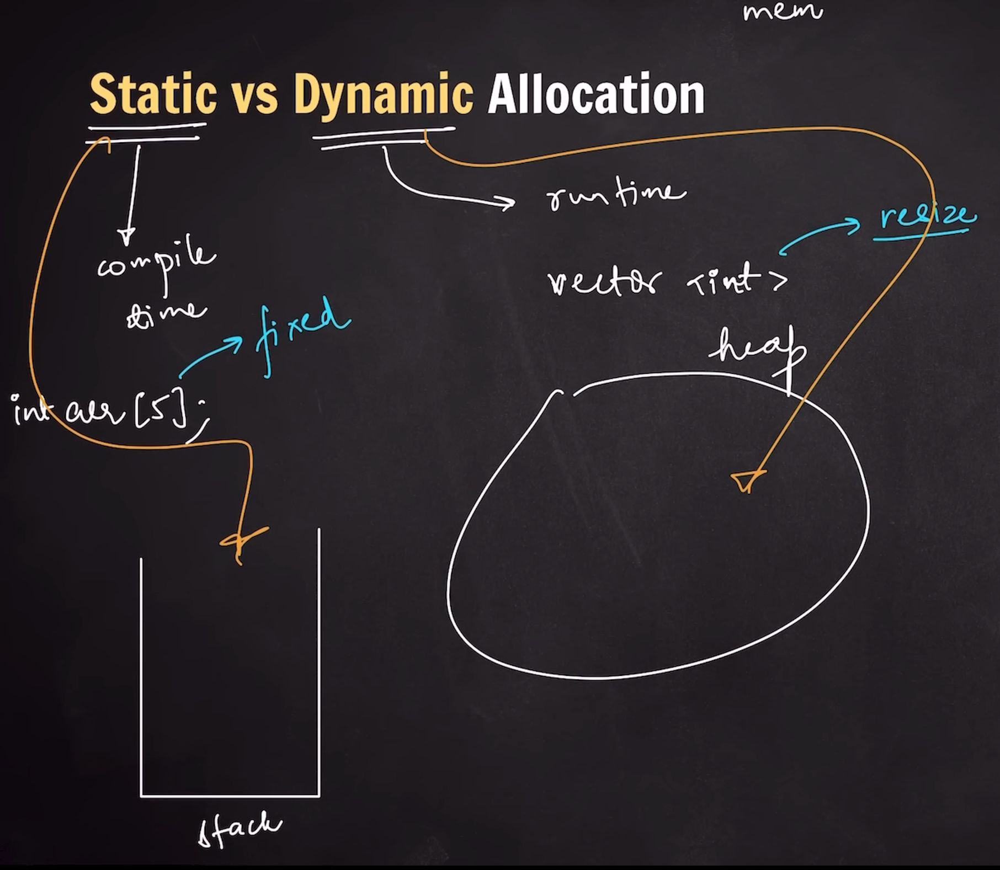

## Vectors

### Introduction
- Vectors - Dynammic unlike Arrays
- have to include <vector> Library
- for each loop 

    ```c++
    vector <int> vec = {1,2,3,4};

    for (int val : vec) {
        cout << val << endl;
    }
    ```

### Vector Function 
1. `size`
    ```c++
    cout << "Size = " << vec.size() << endl;
    ```
2. `push_back` --> Add the value at the end & order will be retained
    ```c++
    cout << "Size before push_back = " << vec.size() << endl; // 4

    vec.push_back(100);
    
    cout << "Size after push_back = " << vec.size() << endl; // 5
    ```
3. `pop_back`
    ```c++
    cout << "Size before push_back = " << vec.size() << endl; // 5

    vec.pop_back();
    
    cout << "Size after push_back = " << vec.size() << endl; // 4

    ```
4. `front`
    ```c++
    cout << vec.front() << endl; // will give the value at the front of the vector
    ```
5. `back`
    ```c++
    cout << vec.back() << endl; // will give the value at the end
    ```
6. `at`
    ```c++
    cout << vec.at(1) << endl; // 2 --> same as writing as vec[1] 
    ```

### Static v/s Dynamic Allocation




- Vectors are arrays only
    - but a new array get created of double size and then it stores new data
    - after that variable name gets assigned to new array
    - old array gets deleted from the memory

        ```c++
        int main() {

        vector <int> vec; // size = 0

        vec.push_back(0); // size --> 1 & capacity --> 1 
        vec.push_back(1); // size --> 2 & capacity --> 2
        vec.push_back(2); // size --> 3 & capacity --> 4 // because it gets double every time it needs to add element to vector
        vec.push_back(3) // size --> 4 & capacity --> 4
        vec.push_back(4) // size --> 5 & capacity --> 8

        cout << "Size --> " << vec.size() << endl;
        cout << "Capacity --> " << vec.capacity() << endl;
        }

        // Output
        // Size --> 5
        // Capacity --> 8
        ```
- Two Propertirs of Vectors
    - Size --> how many elements are there in Vector
    - Capacity --> how many elements can get stored

### Bitwise XOR to find Unique Value

- 
    ```c++
    #include <iostream>
    #include <vector>
    using namespace std;

    int singleNumber(vector<int>& nums) {
        int ans = 0 ;
        for (int val : nums) {
            ans ^= val;
        }

        return ans;
    }

    int main() {
        vector <int> nums = {2,2,100};
        cout << singleNumber(nums) << endl;
    }

    // Bitwise Operations: XOR
    // n^n = 0
    // n^0 = n

    ```